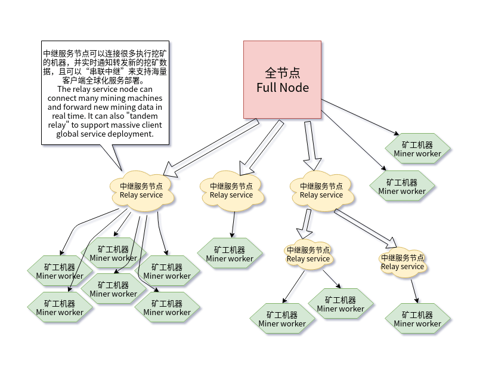

Hacash 挖矿规范、数据和服务接口文档
===

本文档包含 Hacash 挖矿相关的一系列数据和服务的运行方式和接口规范，用于开发第三方商业矿池、私人挖矿客户端或矿池统计服务等等与挖矿相关的业务。

1 体系结构
---

我们采用“中继节点（Relay Nodes）”方式提供挖矿相关的数据接口服务，示意如下：




中继节点不仅是连接若干个挖矿客户端的服务端，也是所有挖矿相关的数据接口的服务端。一个 Hacash 全节点下面可以挂载若干个中继节点（基于TCP连接，连接数量视服务器性能和带宽大小而定），中继节点还可以树状串联（即中继节点作为服务端，下方再连接挂载若干个个中继节点，且可以多层连接），由此可以在一个全节点下方挂载理论上无数台挖矿客户端机器。

挖矿客户端（矿工机器）除了可连接到中继节点，有需要时也可以直接连接到全节点。中继服务节点除了提供实时的挖矿相关的状态和数据、计算生成挖矿所需的数据准备材料，也可以统计和保存下连矿工的算力数据，并且提供算力统计数据的查询接口，为更上层的矿池整体算力计算和奖励分配计算提供统计数据。

2 部署运行
---

请在 [software_release_log.md](https://github.com/hacash/miner/blob/master/doc/software_release_log.md) 地址中下载全节点软件和中继服务节点软件，分别按照一下配置运行

第一步：首先需要运行一台 Hacash 的全节点，相关配置文件 `hacash.config.ini` 如下：

```ini
data_dir = ./hacash_mainnet_data

[p2p]
listen_port = 3337
boot_nodes = 182.92.163.225:3337,47.244.26.14:3337

[miner]
enable = true
rewards = 1AVRuFXNFi3rdMrPH4hdqSgFrEBnWisWaS

[minerserver]
enable = true
listen_port = 3350
```

以上配置中， `[miner]` 必须开启，表示全节点开启挖矿相关功能。而 `[minerserver]` 部分也必须同时开启，表示开启挖矿服务端服务，且服务监听 TCP 端口为 `3350` ，中继节点需要连接到此端口以同步最新区块信息。

命令行运行示例如下：

```shell script
./hacash_node_2021_05_15_01 hacash.config.ini
```

第二步：运行中继节点并连接到全节点，相关配置文件 `hacash_relay_service.config.ini` 如下：

```ini
server_connect = 127.0.0.1:3350
server_listen_port = 19991

http_api_listen_port = 8080

accept_hashrate = true
report_hashrate = true

[store]
enable = true
data_dir = ./hacash_relay_service_data
save_mining_block_stuff = true
save_mining_hash = true
save_mining_nonce = true
```

以上配置，其中 `server_connect` 表示要连接到的全节点或上级中继节点。 `server_listen_port` 表示本中继服务监听的端口，以供下级中继节点连接。 `http_api_listen_port` 表示 http 的 api 服务监听的端口。 `accept_hashrate` 表示是否接受下级中继节点上报的算力统计数据， `report_hashrate` 表示是否向上级中继节点或全节点提交算力统计信息。

`[store]` 配置部分则与保存算力统计和挖矿日志相关。

命令行运行示例如下：

```shell script
./hacash_miner_relay_service_2021_05_12_01 hacash_relay_service.config.ini
```

正常情况下可以看到输出：

```
Load ini config file: "./hacash_relay_service.config.ini" at time:07/15 17:17:27
[Miner Relay Service] Start server and listen on port 19991.
[Miner Relay Service] Http api listen on port: 8080
connecting server <127.0.0.1:3350>... success.
note: pool is not accept PoW power statistics.
receive new block <257282> mining stuff forward to [0] clients at time 07/15 17:17:28.

```

服务正确运行之后，我们访问 `http://127.0.0.1:8080/` 将看待如下信息

```js
{
  ret: 0,
  service: "hacash miner relay service"
}
```

表示 HTTP 接口服务正常运行中。

3 HTTP 接口服务
---

#### 3.1 [GET] /query?action=pending_block 获取当前正在挖矿的区块信息

示例接口访问： `http://127.0.0.1:8080/query?action=pending_block&only_height=0&unitmei=0`

可选参数：

- [only_height] `bool` 是否只返回区块高度，用于判断最新挖掘的区块高度是否发生变化
- [unitmei] `bool` 是否按浮点数单位`枚`的形式返回 HAC 的数量

返回值示例：

```js
{
    block: {
        height: 257301
    },
    ret: 0
}

// 或者

{
    block: {
        difficulty: 3670274902,
        height: 257301,
        prevhash: "00000000006cddd0c5837d077509714aa8070588599ce35ad41188c14a911ec9",
        timestamp: 1626342425,
        transaction_count: 1,
        version: 1,
        witness_stage: 0
    },
    coinbase: {
        address: "1AVRuFXNFi3rdMrPH4hdqSgFrEBnWisWaS",
        body_version: 1,
        message: "",
        message_hex: "20202020202020202020202020202020",
        reward: "ㄜ2:248",
        witness_count: 0,
        witness_sigs: [ ],
        witnesses: [ ]
    },
    mrkl_miner_related_hash_list: [ ],
    ret: 0
}
```

本接口将返回所有与挖矿相关的区块信息（不包含交易列表），理论上第三方开发者可以按照区块数据格式“拼装”成区块头数据，并根据默克尔相关hash（即 `mrkl_miner_related_hash_list` 参数）得出待挖矿基础数据。但这需要深度理解 Hacash 的区块数格式细节，对于第三方开发者来说过于复杂。所以我们接下来提供另一个十分简捷的接口来获得待挖矿基础数据。

#### 3.2 [GET] /query?action=mining_stuff 获取挖矿模块数据

示例接口访问： `http://127.0.0.1:8080/query?action=mining_stuff`

返回值示例：

```js
{
    ret: 0,
    height: 257301,
    target_difficulty_hash: "00000000061f9ab0000000000000000000000000000000000000000000000000",
    coinbase_nonce: "6d4519e65ec75d191d741343d3a46fcf8f75081aacddd01d2be25f0febb9d760",
    stuff: "01000003ed150060f0041900000000006cddd0c5837d077509714aa8070588599ce35ad41188c14a911ec9dbe4be5a0ce2729659e5dbba7d6dea54a9e4b62dffd811a1cfad66ae33eac0390000000100000000dac3f3560000",
    head_nonce_start: 79,
    head_nonce_len: 4
}
```

本接口以最简捷且向后兼容的格式返回待挖矿的基础数据，第三方无需理解区块格式的细节。具体返回值说明如下：

- [height] `int` 待挖矿的区块高度
- [target_difficulty_hash] 难度目标哈希值，用于判断挖矿是否成功
- [coinbase_nonce] `hex string` 以 HEX 格式返回的随机 nonce 值，此值每次访问接口时都会随机产生，为固定长度32位hash，每次都不同。此值需要临时保存在挖矿客户端，以便向服务器报告挖矿结果时附带回传，具体用途将在下文解释
- [stuff] `hex string` 以 HEX 格式返回的区块挖矿基础数据，用于做 `x16rs` 算法挖矿的输入数据
- [head_nonce_start] `int` 区块头 nonce 值在基础挖矿数据（即 stuff 返回值）内的起始位置
- [head_nonce_len] `int` 区块头 nonce 值的长度

与其它基于 PoW 挖矿的项目一样，Hacash 也通过不断的重复尝试某种哈希运算（不断地改变输入值），直到寻找到符合难度目标的哈希。 Hacash 的区块挖掘哈希函数采用原创的 `X16RS` 算法，要了解这种算法的细节请参见源代码 [https://github.com/hacash/x16rs/blob/master/x16rs.go#L72](https://github.com/hacash/x16rs/blob/master/x16rs.go#L72) 中的两个相关函数：

```go
func HashX16RS(loopnum int, data []byte) []byte {
    // ...
}

func CalculateBlockHash(blockHeight uint64, stuff []byte) []byte {
    // ...
}
```

其中 `CalculateBlockHash(uint64, []byte)` 函数的两个参数即分别是上文接口返回的 `height` 与 `stuff` 的值，此函数返回一个 32 位的哈希结果，即区块哈希，用于判断挖矿是否成功。但如果每次都传递相同的 height 与 stuff 值，则 CalculateBlockHash 函数返回的哈希结果不变。

挖矿的过程即每次都尝试不同的 `stuff` 值作为 `CalculateBlockHash` 函数的参数，多次执行运算得出不同的结果，并判断哈希结果是否满足难度要求（即 target_difficulty_hash 返回值，比此目标难度哈希定义的更“小”的哈希 ）的过程。

但 `stuff` 的值并不是完全随机的，它包含了区块头的结构化数据，所以不能随机任意传递 `stuff` 的值，而必须在上文接口中 `stuff` 返回数据的基础上按规则修改，才能得到合法的 `stuff` 值。合法的修改需要借助于 `head_nonce_start` 以及 `head_nonce_len` 两个参数，也就是说，只有这两个值定义的 stuff 数据的指定部分才是可以随机修改的，我们称作为 `head_nonce`，而其它部分不能修改，否则导致区块数据被破坏，挖矿将无效。由于必须考虑到区块格式版本升级等向后兼容的问题，所以 `stuff` 值中可以被随机替换的部分也可能在将来被升级改动，所以 `head_nonce_start` 和 `head_nonce_len` 的值并不是固定不变的，这也就意味着 `stuff` 能够被合法随机替换的部分，包括位置和长度，也是可能变动的。

例如上文接口返回的 `stuff` 值是一个长度为 89 的 buffer ， `head_nonce_start` 返回 79 且 `head_nonce_len` 返回 4 则表示 stuff 数据 buffer 数组索引（下标从 0 开始） 79 位开始的后 4 位值是可以随机替换的 `head_nonce` 值，具体为下面数据中被括号括起来的数据（即 00000001 四位字节）是可以被随机替换的部分。

01000003ed380060f035f000000000011c057cabe71255adb713ffda047e429e602054154416432299e3b089ba5abbbbc8eca9c38d5bcdada7fdf8c81027b61ddfd11adb27be19520ecf63(`00000001`)00000000dac3f3560000

总共四位可被随机替换，则共有 `255^4 = 4228250625` 约 42 亿次哈希运算尝试的机会。如果 42 亿个 `head_nonce` 被全部尝试完毕却仍然没有找到复合目标难度的哈希结果，则需要再次调用本接口（即 /query?action=pending_block ）以获得一个新的 `stuff` 值及一个新的 32 位的 `coinbase_nonce` 值。也就是说，Hacash 区块内部其实有两个可以随机尝试替换的 nonce 值： `coinbase_nonce` 和 `head_nonce`。而一旦 `coinbase_nonce` 值改变，则 `head_nonce` 又将获得一个新的 42 次尝试机会。只不过，为了封装技术细节，保持第三方挖矿的简洁性，从 `coinbase_nonce` 值结合区块头数据生成有效 `stuff` 这一过程被隐藏了，由接口每次被调用时自动化随机生成 `coinbase_nonce` 供大家直接使用。

那么如何判断 `CalculateBlockHash` 挖矿函数的哈希结果是否满足难度目标（即挖矿成功）呢？我们来看另一个位于 [https://github.com/hacash/mint/blob/master/difficulty/check.go#L14](https://github.com/hacash/mint/blob/master/difficulty/check.go#L14) 的函数 `CheckHashDifficultySatisfy`：

```go
func CheckHashDifficultySatisfy(result_hash, target_diffculty_hash []byte) bool {
	if len(result_hash) != 32 || len(target_diffculty_hash) != 32 {
		panic("CheckHashDifficultySatisfy hx1, hx2 size must be 32.")
	}
	for k := 0; k < 32; k++ {
		if result_hash[k] < target_diffculty_hash[k] {
			return true
		} else if result_hash[k] > target_diffculty_hash[k] {
			return false
		}
	}
	return true
}
```

此函数很简单，即比较哈希计算尝试的结果 `result_hash` 与目标难度哈希值 `target_diffculty_hash` 的“大小”，当 结果哈希“小于”目标难度时（也就是表现为哈希值前导零的数量更多），则表示挖矿成功。


#### 3.3 [GET] /submit?action=mining_result 提交挖矿结果（挖矿成功或者算力统计）

示例接口访问： `http://127.0.0.1:8080/submit?action=mining_result&mint_success=0&reward_address=1AVRuFXNFi3rdMrPH4hdqSgFrEBnWisWaS&block_height=257370&head_nonce=f6f6f6f6&coinbase_nonce=6d4519e65ec75d191d741343d3a46fcf8f75081aacddd01d2be25f0febb9d760`

参数说明：

- [mint_success] `bool` 本地自己判断是否挖矿成功（远程服务端会再做一次判断）
- [reward_address] `string` 挖矿奖励统计的收益账户
- [block_height] `int` 本次挖矿的区块高度 
- [head_nonce] `hex string` 挖矿的随机数结果
- [coinbase_nonce] `hex string` 从接口获取并原样回传的 coinbase_nonce 值

返回结果：

```js
{
    ret: 0,
    stat: "ok"
}
```

在上一个接口 `/query?action=mining_stuff` 内获取的 `coinbase_nonce` 值，需要在本接口原封不动的回传，服务端将用到此参数进行区块头数据的组装和哈希运算结果的验证。

当我们判断成功挖到一个区块时，则调用本接口，提交 `head_nonce` 及相关数据，中继节点会一层一层提交到全节点，并且验证后将成功挖到的区块广播到全网，其他所有矿工就会收到新的区块，自动开始挖掘下一个区块。

同样，当别人成功挖掘到区块时，新的区块通知将到达每一台矿机，所有矿工自动调用 `/query?action=mining_stuff` 接口获取下一个将被挖掘的区块数据，开始新一轮的挖掘。

但 HTTP 接口是无状态的协议，你可以通过定时轮询 `/query?action=pending_block&only_height=1` 判断是否有新区快到来，从而判断是否切换到下一个挖掘的区块上。 当然，如果你的采矿机器性能足够好，可以在几秒甚至一秒以内尝试完 42 亿次的 `head_nonce` 值空间，那就不需要轮询监听新区块了， `/query?action=mining_stuff` 接口会自动返回新待挖掘的区块数据。

